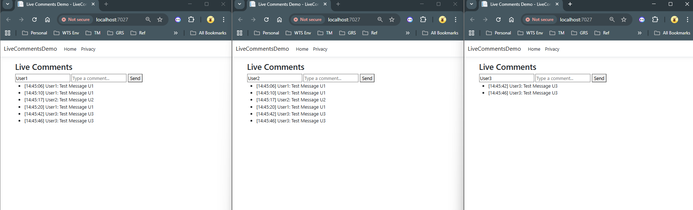

# LiveCommentsDemo

A mini **Live Comments** demo built with **ASP.NET Core MVC** and **SignalR**, demonstrating real-time comment broadcasting for live video feeds. This project is designed for **learning and experimenting with real-time web technologies**.

---

## Screenshot of the Demo


---

## Features

- Post and broadcast comments in **real-time**.  
- Viewers see **new comments instantly** in multiple browser tabs.  
- Supports **multiple live video rooms**.  
- **Persist comments** using SQLite + EF Core.  
- Supports different SignalR transports: **WebSockets**, **Server-Sent Events (SSE)**, and **Long Polling**.  
- Tracks **latency per comment** (end-to-end).  
- Simple UI for testing and learning.

---

## Tech Stack

- **Backend**: ASP.NET Core MVC (.NET 8)  
- **Real-Time Communication**: SignalR  
- **Frontend**: HTML + JavaScript  
- **Database**: SQLite with EF Core

---

## Architecture Overview


**Description:**  
- **Frontend**: Users enter a name and a comment in the browser.  
- **SignalR Hub**: Handles broadcasting comments to all connected clients in real-time.  
- **Storage**: Comments are persisted in **SQLite**, so they remain after server restarts.  
- **Rooms/Groups**: Each live video has a dedicated SignalR group to separate streams.  
- **Transports**: WebSockets, SSE, or Long Polling are automatically negotiated.

---

## Setup & Run

### Prerequisites

- [.NET 8 SDK](https://dotnet.microsoft.com/en-us/download/dotnet/8.0) installed  
- SQLite (optional: GUI tool like DB Browser for SQLite)

### Steps

1. Clone the repository:

```bash
git clone https://github.com/yourusername/LiveCommentsDemo.git
cd LiveCommentsDemo

Restore dependencies:

dotnet restore


Apply migrations (creates SQLite database):

dotnet ef database update


Run the project:

dotnet run


Open browser at https://localhost:5001 (or the URL shown in console).

Open multiple tabs to simulate multiple viewers.

Enter a username and a comment → click Send.

Comments appear in all tabs instantly and are persisted in SQLite.

Switch between live video rooms to see room-specific comments.

Usage Notes

Each comment is timestamped on the server.

SignalR automatically negotiates the best available transport: WebSockets → SSE → Long Polling.

Changing transport requires page reload for the demo.

Historical comments are loaded when joining a room, and persist after server restarts.

Future Extensions

Add reactions, replies, and moderation.

Implement Dispatcher / Pub-Sub simulation for scaling across multiple servers.

Display real-time latency metrics for different transports.

Improve UI/UX with modern frameworks like React or Blazor.


This version now:

- Reflects that **comments are persisted** in SQLite.  
- Mentions **multi-room support**.  
- Explains **transports** clearly.  
- Has proper Markdown headings and code blocks.  
- Removes references to “basic in-memory only” that are no longer accurate.  

---

If you want, I can also **draft a smaller LinkedIn-ready version** showing your hands-on demo with a screenshot and highlighting **what you learned from SSE/WebSocket/Polling comparison**. This will make the post look more professional despite it being a mini project.  

Do you want me to do that next?