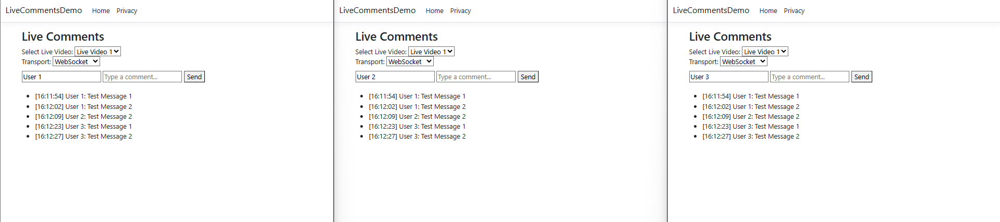

# LiveCommentsDemo

A mini live comments demo built with **ASP.NET Core MVC** and **SignalR**, demonstrating real-time comment broadcasting for live video feeds. This project is designed for learning and experimenting with **real-time web technologies**.

---

## Screenshot of the result demo


## Features

- Post and broadcast comments in **real-time**.  
- Viewers see **new comments instantly** in multiple browser tabs.  
- Built with **in-memory storage** (no database yet).  
- Supports different SignalR transports: **WebSockets**, **Server-Sent Events (SSE)**, and **Long Polling**.  
- Simple UI for testing and learning.

---

## Tech Stack

- **Backend**: ASP.NET Core MVC (.NET 8)  
- **Real-Time Communication**: SignalR  
- **Frontend**: HTML + JavaScript  
- **Storage**: In-memory (for simplicity, can be extended to SQLite)

---

## Architecture Overview
+-------------------+ SignalR (WebSockets/SSE/LongPolling) +-------------------+
| | <----------------------------------------------> | |
| Browser | | ASP.NET Core |
| (UI + JS client) | | MVC + Hub |
| | | |
+-------------------+ +-------------------+
| |
v v
In-Memory Comment Storage -------------------> Stores and retrieves comments


**Description:**  
- **Frontend**: Users enter a name and a comment in the browser.  
- **SignalR Hub**: Handles broadcasting comments to all connected clients in real-time.  
- **Storage**: In-memory list of comments, allowing live display to all connected users.

---

## Setup & Run

### Steps

1. Clone the repository:

```bash
git clone https://github.com/yourusername/LiveCommentsDemo.git
cd LiveCommentsDemo

Restore dependencies:

dotnet restore


Run the project:

dotnet run


### Open browser at https://localhost:5001 (or the URL shown in console).

### Open multiple tabs to simulate multiple viewers. Enter a username and a comment → click Send. Comments appear in all tabs instantly.


### Usage

Each comment is timestamped on the server.

Real-time broadcast ensures all connected clients see new comments immediately.

SignalR automatically negotiates the best available transport: WebSockets → SSE → Long Polling.

Future Extensions

Persist comments using SQLite + EF Core.

Support multiple live video rooms with SignalR groups.

Add reactions, replies, and moderation.

Include a UI to switch transport modes and display latency.
